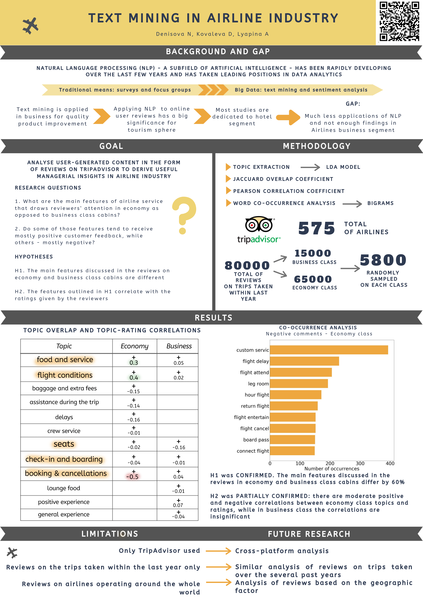

# Coursework
### Text Mining and Firm's Behaviour

Third year Management team coursework on the topic of analysing consumer reviews in airline industry based on TripAdvisor.com data.

*Abstract:*
Over the recent years the field of Natural Language Processing has been rapidly developing as well as widely used in business. Analysing User Generated Data in the form of online reviews has allowed researchers to uncover managerial insights on topics ranging from identifying issues of a product to predicting films’ box office success. This paper is focused on analysing customer reviews on airlines in economy and business class sector. The reviews analysed in this research were posted on TripAdvisor over the course of 2018-2019. The research questions it sets are what features are discussed in reviews on economy class cabins as opposed to business class and if some of those features tend to be evaluated by customers as mostly positive or negative. The total of about 5,000 reviews on economy and same number of reviews on business class is collected and analysed via Latent Dirichlet Allocation topic modelling algorithm. Next, Pearson coefficient correlation is computed for the identified topics and review ratings. The first hypothesis stating that main features discussed in reviews on the two different cabin types tend to differ is confirmed with the Jaccard overlap coefficient for the topics being about 41%. The second hypothesis stating that there are topic and rating correlations for both cabin types is confirmed partially with economy class reviews topics having some moderate positive and negative correlations with the ratings and business class reviews having very little to no correlation with the ratings. Since the research is focused on one particular user feedback platform, only analyses the reviews on trips taken over 2018-2019 and processes all reviews with no regard to companies’ geographic location, some ideas for future research include cross-platform analysis, analysis of the shifts in consumer attitude over the course of several years and comparative research of customer feedback in different geographical regions. 

*Keywords:* Natural Language Processing, Text Mining, Airline Reviews, Latent Dirichlet Allocation, Topic Extraction

### Presentation poster

